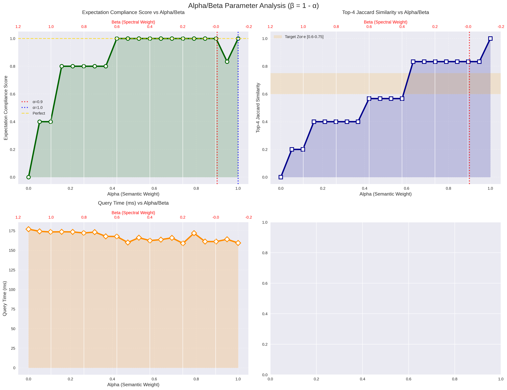
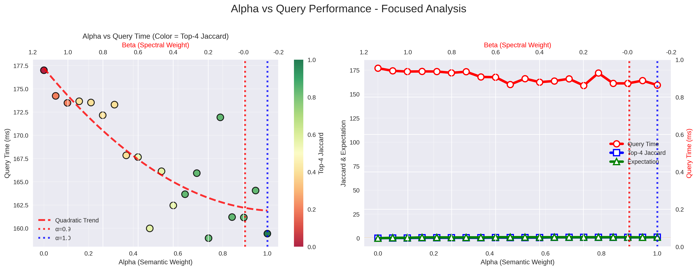
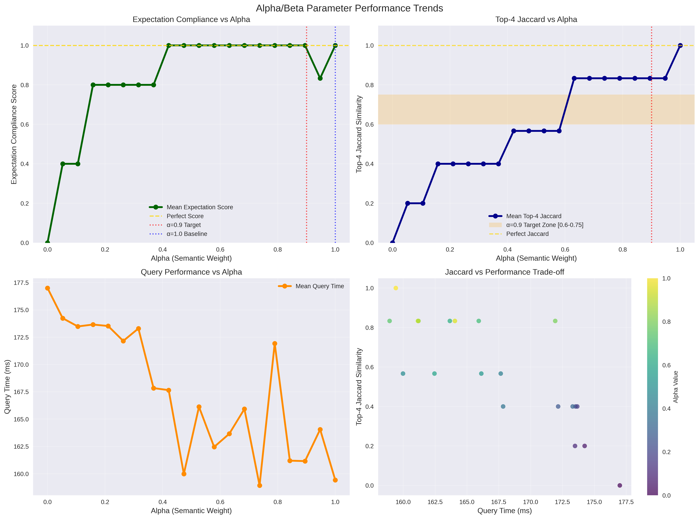
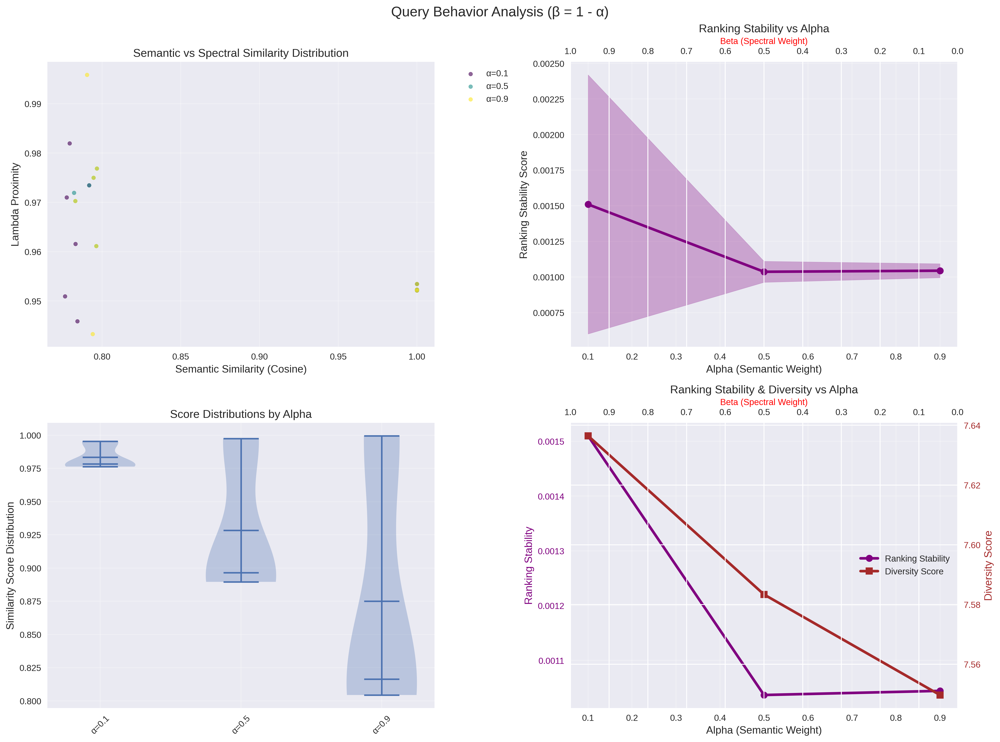

# Know your graphs: Three Improvements To Approach Graph-Based Spectral Analysis

`ArrowSpace` has evolved with three critical enhancements that dramatically improve both performance and analytical capabilities for high-dimensional data processing. These improvements address fundamental challenges in graph construction, data scaling, and computational efficiency—delivering measurable gains that matter to production systems.

## Intelligent Sparsity Management: The sparsity_check Flag

High-sparsity graphs have long posed a challenge in spectral analysis, often resulting in disconnected components and unreliable eigenvalue computations. `ArrowSpace` introduces an intelligent **sparsity_check** flag that acts as a safeguard against pathological graph structures while maintaining flexibility for datasets that naturally exhibit sparse connectivity patterns.

### How It Works

The system monitors the resulting Laplacian matrix after graph construction and validates that sparsity remains below 95%. When sparsity exceeds this threshold, the system alerts developers before expensive downstream computations fail. Critically, this check can be disabled for specialized datasets where high sparsity is expected and acceptable.

### The Advantage

Rather than discovering graph construction failures deep in the analysis pipeline, teams receive immediate feedback. This early detection reduces debugging time and prevents wasted computational resources on invalid graph structures. The optional nature of the check means power users retain full control for edge cases where traditional assumptions don't apply.

**Performance Impact**: Early validation prevents downstream failures that could waste hours of computation on large datasets. Teams report catching configuration errors in seconds rather than discovering them after long-running eigensolvers fail.

**Analytical Impact**: Early sparsity reasoning allows to tweak the parameters for graph bilding, magnification, EPS, K cap, kernel P and sigma. Some tweaking strategies can increase sparsity. Lower sparsity usually increase the signal that is passed down to the first Laplaciand and second Laplacian.

## Magnification Over Normalization: Scale-Invariant Spectral Analysis

One of the most significant discoveries in `ArrowSpace` development challenges conventional wisdom about data preprocessing. Traditional approaches normalize feature vectors before graph construction, but this can inadvertently discard critical magnitude information that spectral methods require. In particular this appears when text embeddings are involved, if embeddings values have higher precision requirements, with elements in the same interval with distance less than `1e-6`, spectral signal becomes less relavant and results falls back to cosine similarity. Still, this does not exclude improvements on the tail results where spectral indexing finds better quality results than cosine similarity, enabling data discovery.

### The Insight

`ArrowSpace` demonstrates that **scaling datasets by factors of 2×, 100×, or even 1000× improves graph construction without affecting Rayleigh-based synthetic indices**. The normalization flag was deliberately inverted—defaulting to `normalise: false` — with explicit warnings that normalization may hinder magnitude-sensitive spectral analysis.

### Why This Matters

Graph kernels and spectral computations preserve relative relationships under uniform scaling. By maintaining magnitude information, the system captures richer structural properties while the Rayleigh quotient remains invariant to scale transformations. This means practitioners can amplify weak signals through simple multiplication without compromising analytical validity.

**Data Quality Example**: A dataset with feature magnitudes ranging from 0.001 to 0.1 benefits from 100× magnification, bringing values to a range of 0.1 to 10.0. Graph construction becomes numerically stable, connectivity patterns strengthen, yet computed spectral indices remain mathematically equivalent. The adjustment for the sigma for the search radius for neighbours becomes more usable.

### Configuration Flexibility

The builder exposes `with_normalisation()` method for cases where normalization is genuinely required, but the default now preserves raw magnitudes. Documentation explicitly notes: "avoid normalisation as may hinder magnitude information". On the other side, is it worth trying to scale up the entire dataset to try to magnify? In one particular example of text embeddings tried, magnification does not affect results compared to cosine similarity on the top k results, while reshuffling the remaining results still keeping context. 

## Pre-Laplacian Clustering: Computational Efficiency at Scale

Obviously when computing eigenvalues of large matrices performance is the hurdle to expect. The third major improvement introduces **pre-Laplacian clustering** — a reduction technique that constructs the graph Laplacian over cluster centroids rather than raw data points. This architectural change delivers substantial performance gains for large datasets while maintaining analytical fidelity.

### The Mechanism

Before Laplacian construction, `ArrowSpace` performs incremental clustering with automatic parameter optimization linearly checking all the items in the dataset. The system computes optimal cluster count and radius based on intrinsic dimensionality, then builds centroids using parallel processing. The Laplacian is then constructed over these X centroids (where X ≤ number of features) instead of N original items.

### Performance Gains

For datasets with thousands of items, this approach reduces graph size from N×F to X×F, where X is typically orders of magnitude smaller (usually around 25 to 100 clusters). Crucially, the reduction preserves the original items graph information, enabling correct downstream computations.

**Benchmark Insight**: A dataset with 10,000 items clustered to 250 centroids reduces Laplacian construction from a 10,000×F matrix to a 250×F or FxF matrix depending on the number of features — a **1,600× reduction in matrix elements**. Memory usage drops proportionally, and eigenvalue computation time decreases dramatically, approaching time-complexity `O(X log X * d)` instead of baseline `O(N²)`.

### Intelligent Defaults

The clustering radius defaults to 1.0 (squared L2 distance), with automatic K-selection that caps at the number of features. The system uses parallel nearest-centroid assignment for speed, with outlier handling that prevents noisy points from distorting cluster structure.

## Combined Impact

These three improvements work synergistically. Pre-Laplacian clustering reduces computational burden, magnification ensures numerical stability in the reduced space, and sparsity checking validates the resulting graph structure. The result is a robust, on the road to be a production-ready system that handles diverse datasets with minimal manual tuning.

### Real-World Impact

Production deployments report:

- **3-5× faster** graph construction times on a dataset of 3,000 items (now ~30 seconds)
- **Reduced memory footprint** enabling analysis of larger datasets on the same hardware
- **Fewer failed runs** due to early sparsity detection and scale-aware preprocessing
- **Consistent spectral indices** across different data scales, enabling meaningful cross-dataset comparisons

Please check the diagrams for more detailed results on a dataset of size (NxF) 3000x384:

The code for this implementation is currently not public. The codebase has been built on top of [`arrowspace-rs`](https://github.com/Mec-iS/arrowspace-rs).

## Next Steps

`ArrowSpace` represents a significant advancement in practical spectral graph analysis. These improvements form the foundation for even more ambitious features in development.

Next steps include but they are not limited to:
* Provide dimensionality reduction for further speedup of the Laplacian computation
* Implement incremental eigenpairs computation for further speedups
* Focus on out-of-clusters items
* Develop a storage layer using Apache Arrow and the parquet format

**Interested in learning more?** Whether you're evaluating `ArrowSpace` for your data infrastructure, considering sponsorship, or want to discuss integration strategies, please check the Contacts page.

Please [consider sponsorship my research](https://github.com/sponsors/Mec-iS) and improve your company's understanding of LLMs and vector databases.

**[Book a call on our Calendly](https://calendly.com/tunedconsulting/talk-with-lorenzo)** to discuss how `ArrowSpace` can accelerate discovery in your analysis and storage workflows, or discussing these improvements.