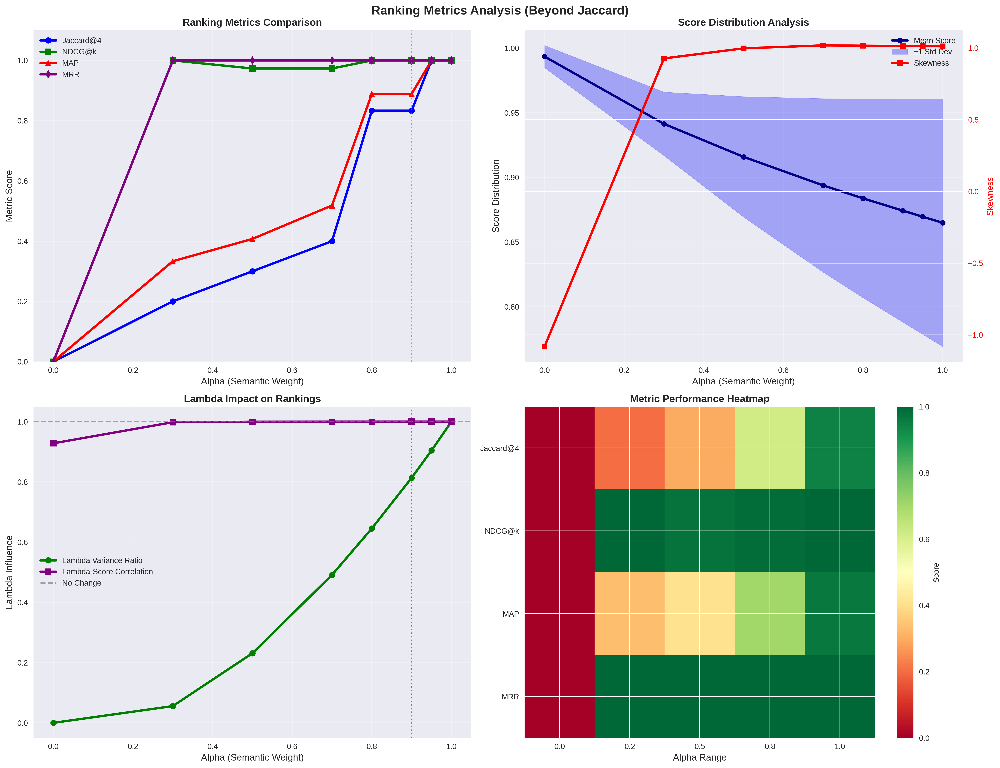

# Condense, Project, and Sparsify

You can find `arrowspace` in the:
* [Rust repository](https://github.com/Mec-iS/arrowspace-rs) ↪️ `cargo add arrowspace`
* and [Python repository](https://github.com/tuned-org-uk/pyarrowspace) ↪️ `pip install arrowspace`

Road for `arrowspace` to scale: this release `v0.13.3` rethinks how `arrowspace` builds and queries graph structure from high‑dimensional embedding up to 10⁵ items and 10³ features. The Laplacian computation now:
1) condenses data with clustering and density‑aware sampling,
2) projects dimensionality proportionally to the problem size (centroids) and keeps queries consistent with that projection, and
3) sparsifies the graph with a fast spectral method to preserve structure while slashing cost.

## 1) Condense the data first: clustering + density‑adaptive sampling

Building a Laplacian directly on millions of items and thousands of features is expensive; most structure can be captured by a compact set of representatives.

- Clustering to ease Laplacian compute
    - Cluster items in embedding space and use the centroids as graph nodes to cut N down by orders of magnitude.
    - The Laplacian is then computed over centroids, not raw items, which reduces k‑NN cost, Laplacian storage, and downstream spectral ops.
- `DensityAdaptiveSampler` for centroids
    - Complement or replace clustering with a density‑aware sampler that selects more centroids where the manifold is dense and fewer where it is sparse.
    - This keeps neighborhood fidelity without inflating node count, making the resulting k‑NN graph more uniform and robust to hubness/anisotropy.

Practical notes:
- Choose target centroid count from budget, not from original feature count.
- Keep k in the k‑NN graph large enough to avoid fragmentation on the reduced set (e.g., 10–30 for a few hundred centroids).
- Cache centroid assignments if later stages (evaluation, attribution) need to lift results back to original items.
- This is practically equivalent to IVF, so it is possible to go a step further to implement IVF-PQ search.

## 2) Dimensionality Reduction: project to the problem size

After condensing to C centroids, distance preservation only needs to hold between those C points; the Johnson–Lindenstrauss (JL) lemma gives a principled target for the projected dimension r.

- Dimensionality reduction through projection
    - Compute r from the number of centroids (not original items), e.g., `r ≈ 8·ln(C)/ε²` for tolerance ε.
    - Project both centroids and their associated item representations to r dimensions before graph building.
    - This reduces memory, improves k‑NN construction time, and helps combat distance concentration in very high dimensions.
- Querying with projection
    - At query time, apply the same projection (same random seed / matrix) to the incoming vector, then compute the synthetic λ on the projected graph and search in the projected space.
    - This keeps train/test geometry aligned: the Laplacian, λ synthesis, and similarity all "see" the same r‑dimensional manifold.

Practical notes:

- Normalize features before projection; keep the projection operator fixed per model version (normalise after clustering).
- Pick ε by latency/quality trade‑off; smaller ε → larger r → better geometric fidelity.
- Store r and projection seed with the built artifact so clients can reproject queries deterministically.

## 3) Make graphs lighter: SF‑GRASS spectral sparsification

Even after condensing and projecting, dense graphs and Laplacians can still be costly. A simplified, fast spectral sparsification (SF‑GRASS) step prunes edges while approximately preserving the spectrum that matters for diffusion, λ computation, and spectral similarity.

- Sparsification (SF‑GRASS)
    - Start from the k‑NN (or locally scaled) weighted graph on centroids.
    - Apply simplified spectral sparsification to obtain a much sparser graph that preserves quadratic forms xᵀLx within a small relative error.
    - This yields a Laplacian that is dramatically cheaper to store and multiply while retaining the eigenstructure relevant to λ and search.
- Storage and ops
    - Keep the Laplacian in a sparse format (e.g., CSR/CSC) for all downstream computations.
    - Traversals and updates use index pointers instead of dense indexing; eigen or diffusion routines get a sizable acceleration on typical sizes.

Practical notes:
- Target an average degree that keeps the graph connected but trims long, low‑weight tails (e.g., density ~5–20% depending on C and k).
- If local scaling or mutual k‑NN was used pre‑sparsification, sparsification tends to preserve cluster‑local edges especially well.
- Validate PSD and symmetry after sparsification; diagonals remain non‑negative and the smallest eigenvalue stays near zero.

***

## Usage at a glance

- Build:
    - Sample or cluster to centroids (C).
    - Compute r from C via JL, project items/centroids to r.
    - Build a k‑NN (optionally locally scaled) graph over centroids.
    - Apply SF‑GRASS to sparsify; store sparse Laplacian and projection.
- Query:
    - Project the query to r with the stored projection.
    - Compute synthetic λ on the projected Laplacian.
    - Search in the projected space with the λ‑aware scorer.

## Migration guide

- If code relied on raw items for Laplacian, switch to centroids via clustering or `DensityAdaptiveSampler`; propagate centroid mapping where needed.
- Introduce a persisted projection (r, seed) tied to the graph artifact; apply it consistently during build and query.
- After building the k‑NN graph, run SF‑GRASS and ensure all Laplacian consumers accept sparse inputs; update tests to iterate via CSR pointers.
- For search, replace ad‑hoc λ heuristics with the unified query path: project → synthesize λ → λ‑aware scoring.

## Why this works well together

- Condensing shrinks the node set to what matters; JL then shrinks dimensions to what the node set needs (not what the raw features had); sparsification shrinks edges to what the spectrum needs. The query path mirrors the training path by reusing the same projection and Laplacian, keeping semantics aligned and stable.

## New Metrics

Here the new metrics for these improvements, let's have a reference about what they display. These are all partial and indicative of trends are they are computed on a limited dataset (NxF: 3000x384) of synthetic data.

### top-left: Ranking Metrics

As one of the main objective of `arrowspace` is to spot alternative pathways for vector similarities, I use different metrics to compare the new measurements to current implementations. Jaccard metric is quite limited for this purpose as it just spots the perfect overlapping between cosine similarities and `arrowspace` similarities; for widening the landscape I have introduced in the visualisation NDCG, MAP and MRR. You can see how they compare on the usual scale from alpha=0.0 to alpha=1.0 (the weigth of cosine similarity in the `taumode` computation). What I read in this is that `taumode` is still equivalent to cosine similarity between alpha=0.6 and alpha=0.8 while making results more interesting as tails may contain alternative pathways.

A bried summary here for you about these metrics:
* NDCG: Evaluates the quality of ranking by considering both relevance scores and position, with logarithmic discounting for lower positions.
* MAP: Average precision across multiple queries, heavily emphasizing precision at each relevant item position.
* MRR: The average reciprocal of the rank of the first relevant item across queries (less relevant as it focuses only on the first ranked item).

A matrix about the characteristics of these metrics:

    <table>
        <thead>
            <tr>
                <th>Feature</th>
                <th>NDCG</th>
                <th>MAP</th>
                <th>MRR</th>
            </tr>
        </thead>
        <tbody>
            <tr>
                <td>Relevance Type</td>
                <td>Binary or graded</td>
                <td>Binary only</td>
                <td>Binary only</td>
            </tr>
            <tr>
                <td>Scope</td>
                <td>Full ranked list</td>
                <td>All relevant items</td>
                <td>First relevant only</td>
            </tr>
            <tr>
                <td>Discount</td>
                <td>Logarithmic</td>
                <td>Precision-based</td>
                <td>None (single position)</td>
            </tr>
            <tr>
                <td>Interpretability</td>
                <td>Low (complex formula)</td>
                <td>Medium (area under PR curve)</td>
                <td>High (average rank)</td>
            </tr>
            <tr>
                <td>Use Case</td>
                <td>Multi-item recommendations</td>
                <td>Top-K search results</td>
                <td>Single-answer search</td>
            </tr>
            <tr>
                <td>Sensitivity</td>
                <td>Balanced across ranks</td>
                <td>Top-heavy</td>
                <td>First position only</td>
            </tr>
        </tbody>
    </table>

### bottom-right: Metric Performance Heatmap

I leave the reading of the other two to you. The bottom-right diagram is interesting as it displays how `taumode` starts to be reliable from alpha=0.6 on all the metrics used.

Next steps include but they are not limited to:
* improve pre-laplacian input data via graph decomposition into sub-graphs
* take some time to finally investigate how to make the queries multi-vector instead of single-vector
* move the basic flow to GPU! So I have to restart from the non-optimised version to build up a GPU-dedicated computation
* Build the database stack for this engine! From the storage layer to the API

**Interested in learning more?** Whether you're evaluating `ArrowSpace` for your data infrastructure, considering sponsorship, or want to discuss integration strategies, please check the Contact page.

Please [consider sponsoring my research](https://github.com/sponsors/tuned-org-uk) and improve your company's understanding of LLMs and vector databases.

**[Book a call on Calendly](https://calendly.com/tunedconsulting/talk-with-lorenzo)** to discuss how `ArrowSpace` can accelerate discovery in your analysis and storage workflows, or discussing these improvements.

