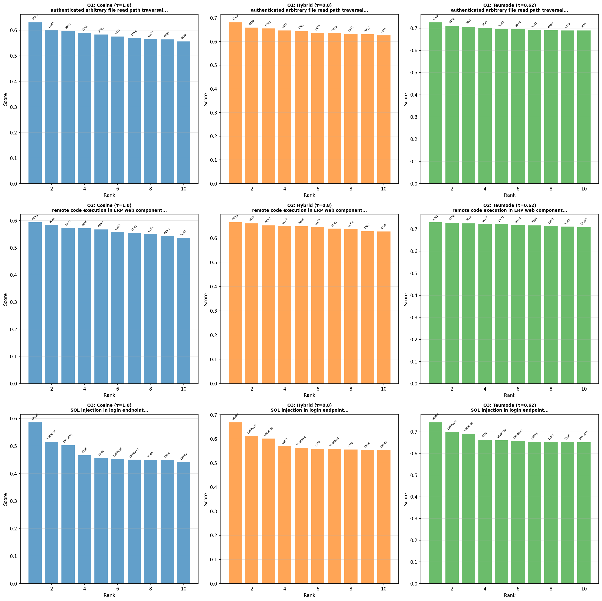
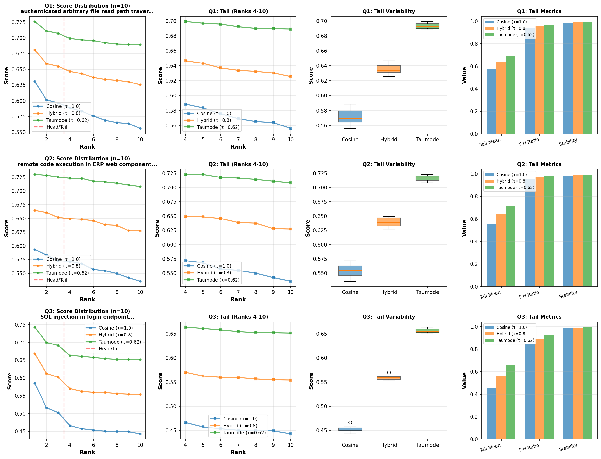

# Taumode: Beyond Cosine Similarity

You can find `arrowspace` in the:
* [Rust repository](https://github.com/Mec-iS/arrowspace-rs) ↪️ `cargo add arrowspace`
* and [Python repository](https://github.com/tuned-org-uk/pyarrowspace) ↪️ `pip install arrowspace`

`ArrowSpace` was exercised on a multi‑year (1999 to 2025) CVE corpus ([cve.org](https://www.cve.org/downloads)) using a domain‑adapted (fine-tuned) encoder and the built‑in `spectral search modes` to evaluate long‑tail retrieval quality against cosine similarity baselines.

The run uses the `ArrowSpaceBuilder` API and the same query pathway for cosine, hybrid, and taumode (τ=0.62, lower taumodes currently in test; τ=0.22 looks even more promising), ensuring identical preprocessing and k‑selection across modes.

## Why this dataset matters

The loader is configured to traverse CVE JSON files across years 1999 to 2025, capturing decades of <i>vulnerability language, shifting CWE taxonomies, and divergent scoring vectors</i> in one benchmarkable corpus.

For this specific run, 310,841 CVEs were parsed from the provided tree, yielding 384‑dimensional embeddings and a realistic mix of classical bugs and modern web‑centric issues, which is an ideal stress test for tail behavior in similarity search.

- Time range parameterization START_YEAR=1999 and END_YEAR=2025 guarantees coverage alignment with modern feeds while allowing reproducible slices for future runs.
- The extracted text blends titles, free‑text descriptions, CWE labels, CVSS vectors, and affected product strings to approximate real analyst queries.

## Metric: Average NDCG@10

The script defines NDCG@k by first treating one ranking as a reference and assigning graded relevance to its top‑k as \(k-i\) for rank \(i\), then calling `sklearn`’s `ndcg_score` over the predicted ranking after normalizing prediction scores.

Average `NDCG@10` is computed by evaluating each query’s `NDCG@10` and then taking the mean across queries, reported for "Hybrid vs Cosine" and "Taumode vs Cosine" comparisons.

- Reference order is cosine; predicted lists are hybrid (τ=0.8) and taumode (τ=0.62), which isolates the spectral contribution while keeping identical candidate pools.
- Normalisation of predicted scores before NDCG prevents scale artifacts from inflating gains, preserving rank‑quality interpretation at cut‑off \(k=10\).

## Technical run details

The builder consumed 310,841 items with 384 features and produced a graph whose search procedure returned consistent top‑k across modes, enabling like‑for‑like metric computation.

End‑to‑end ArrowSpace build time was ~2225 seconds on this snapshot (local machine, 12 cores, limited RAM), including array conversion, validity checks, and λ precomputation.

- The run issued three analyst‑style queries and executed identical searches with τ∈{1.0, 0.8, 0.62} to collect correlation, `NDCG@10`, and tail statistics per query.
- Embedding generation confirmed shape (310841, 384), and queries were encoded with the same model to preserve geometry between build and search.
- [Full print of the logging here](https://gist.github.com/Mec-iS/247515726913c139a320e6c7600c795c).

### Key run facts

  <table>
    <thead>
      <tr>
        <th>Aspect</th>
        <th>Value</th>
        <th>Notes</th>
      </tr>
    </thead>
    <tbody>
      <tr>
        <td>Corpus window</td>
        <td>1999–2025</td>
        <td>Year‑range parameters in the loader</td>
      </tr>
      <tr>
        <td>Items × Features</td>
        <td>310,841 × 384</td>
        <td>Embedding shape after encoding</td>
      </tr>
      <tr>
        <td>Build time</td>
        <td>~2225 s</td>
        <td>`ArrowSpaceBuilder.build(...)` timing on 12 cores CPU</td>
      </tr>
      <tr>
        <td>Avg NDCG@10 (Hybrid vs Cosine)</td>
        <td>0.9988</td>
        <td>Mean across 3 queries</td>
      </tr>
      <tr>
        <td>Avg NDCG@10 (Taumode vs Cosine)</td>
        <td>0.9886</td>
        <td>Mean across 3 queries</td>
      </tr>
      <tr>
        <td>Avg Tail/Head ratio (Cosine)</td>
        <td>0.9114 ± 0.0463</td>
        <td>Higher is better tail quality</td>
      </tr>
      <tr>
        <td>Avg Tail/Head ratio (Hybrid)</td>
        <td>0.9394 ± 0.0340</td>
        <td>Consistent uplift over cosine</td>
      </tr>
      <tr>
        <td>Avg Tail/Head ratio (Taumode)</td>
        <td>0.9593 ± 0.0259</td>
        <td>Best long‑tail stability in this run</td>
      </tr>
    </tbody>
  </table>

## What the numbers show

Across all three queries, `τ<1.0` modes preserve near‑perfect agreement with cosine in the head while delivering stronger scores in ranks 4–10, with Taumode posting the highest Tail/Head ratio and the lowest tail coefficient of variation.

Per‑query `NDCG@10` for "Taumode" (`τ=0.62`) against "Cosine" ranges from 0.9754 to 0.9953, and the average settles at 0.9886, indicating head alignment with controlled diversification in the tail. So we see that for these three particular queries Taumode lose a little in mean `NDCG@10`. On the other hand:
- Tail/Head ratio improves from 0.9114 (Cosine) to 0.9593 (Taumode) on average, quantifying better quality and stability for long‑tail recommendations.
- Rank‑order correlations remain high, confirming that spectral modes re‑weight rather than disrupt, which is desirable for analyst trust and auditability.

We can see below how Taumode acts as a kind of "temperature" slider defining the trade-off between top-1 and top-k quality of results.

## Diagrams

Three queries have been run according to the experiment as designed above:
* "authenticated arbitrary file read path traversal",
* "remote code execution in ERP web component",
* "SQL injection in login endpoint".

These have been passed through the fine-tuned embeddings model, their taumode computed with the `GraphLaplacian` as generated from the corpus and searched via the pre-built index.

### Bar series

The bar series compares top‑10 score profiles for the three modes across the queries, and the tail panel contrasts long‑rank dispersion, stability, and head‑to‑tail balance.

Check the scale, Taumode (green on the right) at 0.62 has a ~15% better score than cosine on the three queries.

### Scores comparison

This set of diagrams compare the queries results' tails.

As you can read, Taumode outperforms in any top-k, demonstating relevant increased tails quality. The curve of the quality decay from top-1 to top-10 moves from something that looks for cosine like an asymptotic relation to a more linear relation for taumode. This represents visually the avoided drop in tails quality.

## Why this is exciting

The combination of high "Average NDCG@10" and materially higher "Tail/Head ratios" suggests Taumode can surface relevant alternatives beyond the very top ranks without sacrificing head fidelity, which is precisely what Taumode was designed for. This experiment demonstate the effectiveness of Tauomde on a real dataset application.

Because the dataset spans two decades of diverse CWE and CVSS phrasing, robustness in the tail indicates <strong>resilience to language drift and domain shift</strong>, a critical property for operational cyber‑threat triage.

This aligns with the objectives of a database engine based on `ArrowSpace`:
* What if we can pass to LLMs documents beyond geometrical relations for more accurate in-context learning? This is what Taumode is for.
* What if we can search the space of documents using and index that incorporates quality of relations? This is what taumode-aware search makes possible.
* What if we can compare your dataset with existing datasets and with others in your company? This is what the spectral analysis enabled by Taumode is meant to deliver.

I am working on a such database engine at www.tuned.org.uk please [consider sponsoring my research](https://github.com/sponsors/Mec-iS).

## Usage at a glance

A great feature is that after it has been computed, <strong>the index can be stored and reused until the spectral signature decay</strong> (further studies are necessary to understand the resilience of the spectral signature in presence of new datapoints in the original dataset but considering that the index is built on the invariants generated by the Laplacian's edgewise computation, it is relatively safe to assume that it will take ~10⁵ new outliers to invalidate the spectral singature; that is quite a good tolerance).

- Build with `ArrowSpaceBuilder` on encoder outputs and persist the artifact for reuse across τ modes to support apples‑to‑apples comparisons.
- Run the three‑mode search for shared top‑k, compute `NDCG@10` against cosine, and log tail statistics to track long‑rank quality over time.
- More comparative tests can be run to sweep the space of taumode (preliminary tests suggest that "Average Tail/Head Ratios" for Taumode (τ=0.22) is 0.9824 ± 0.0064)

## Next steps

- Expand ingestion to larger CVE slices and additional queries to validate the observed tail advantage statistically at scale.
- Add automated regression checks on Average NDCG@10 and Tail/Head ratio to protect long‑tail quality as parameters evolve.
- Build a storage layer for `parquet` files using Apache Arrow
- Go GPU-enable

**Interested in learning more?** Whether you're evaluating `ArrowSpace` for your data infrastructure, considering sponsorship, or want to discuss integration strategies, please check the Contact page.

Please [consider sponsoring my research](https://github.com/sponsors/Mec-iS) and improve your company's understanding of LLMs and vector databases.

**[Book a call on Calendly](https://calendly.com/tunedconsulting/talk-with-lorenzo)** to discuss how `ArrowSpace` can accelerate discovery in your analysis and storage workflows, or discussing these improvements.

