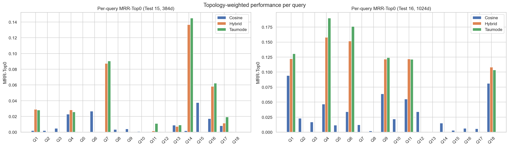
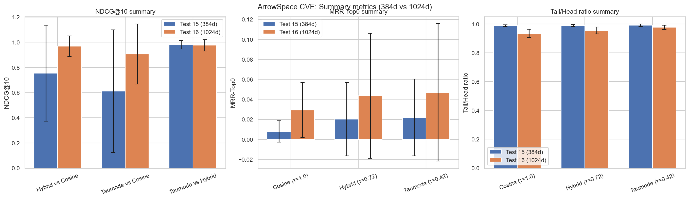
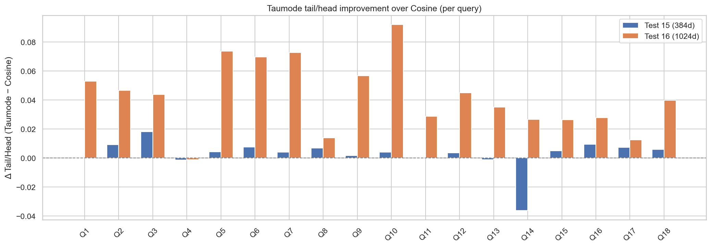
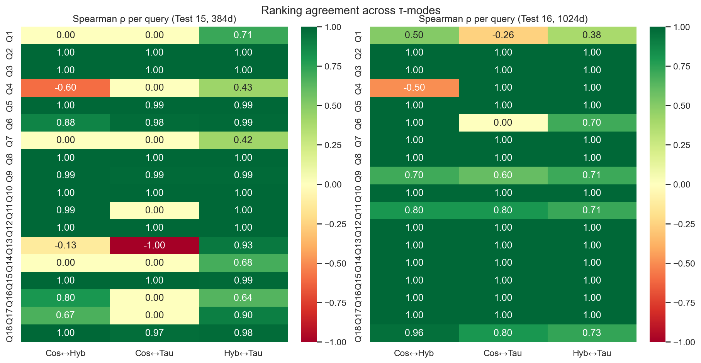
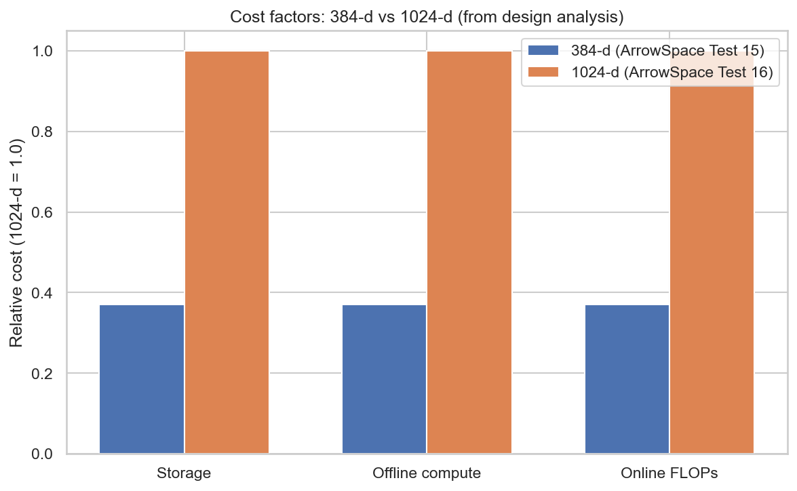

# Testing `arrowspace` on a new wave of embeddings

I ran new experiments on the CVE dataset to compare ArrowSpace search with two embedding backends: the original 384‑dimensional `DenoisingAutoEncoder` (test 15) and Perplexity’s newest 1024‑dimensional embeddings based on pretrained Qwen3 base models (0.6B parameters, “pplx‑embed”) (test 16). The goal is to see how ArrowSpace behaves as embedding dimensionality grows, and how much extra quality we actually gain relative to the cost in memory, training, and inference.

TLDR;

> **ArrowSpace is consistently better than plain cosine on highly semantic vector spaces, and its advantages remain coherent as embedding dimensionality grows.**

Even when we upgrade to strong 1024‑dim embeddings, ArrowSpace’s spectral modes (hybrid/taumode) keep their edge on structure‑aware retrieval and tail behaviour, while the cost gap between 384 and 1024 dimensions stays significant.

Previous blog posts on testing ArrowSpace on CVE [here](/blog).

Code and data:
* [new embeddings training script](https://github.com/tuned-org-uk/pyarrowspace/blob/main/tests/embeddings_ppx_0_6B.py)
* [testing script](https://github.com/tuned-org-uk/pyarrowspace/blob/main/tests/test_16_CVE_ppx_embed.py)
* [test results](https://github.com/tuned-org-uk/pyarrowspace/tree/main/tests/output/v0_25/1772809663_test_16_ppx_low_k)

## 1. Experimental setups (test 15 vs 16)

- Both tests use the same CVE JSON pipeline, the same query set (18 security queries), the same ArrowSpace graph parameters, the same tau grid (cosine τ=1.0, hybrid τ=0.72, taumode τ=0.42) and the same evaluation metrics (Spearman, Kendall, NDCG@10, MRR‑Top0, tail metrics).
- Test 15 encodes CVEs with a domain‑adapted 384‑dim SentenceTransformer autoencoder, scaled to float64.
- Test 16 repeats the same ArrowSpace build and evaluation but using 1024‑dim Perplexity embeddings, with the same graph and tau configuration and the same per‑query metrics and tail analysis CSVs.

So the main **difference** is purely the base embedding model (384 vs 1024 dimensions); the ArrowSpace spectral layer and evaluation protocol are held constant.

## 2. Global quality metrics

From the per‑run summaries:

- **NDCG@10**
    - Test 15 (384‑dim):
        - Hybrid vs cosine: 0.754
        - Taumode vs cosine: 0.611
        - Taumode vs hybrid: 0.980
    - Test 16 (1024‑dim):
        - Hybrid vs cosine: 0.968
        - Taumode vs cosine: 0.906
        - Taumode vs hybrid: 0.976

Interpretation: with 1024‑dim embeddings, cosine and hybrid rankings are much closer (NDCG ≈ 0.97 vs ≈ 0.75), meaning the raw embedding space is already better aligned and cosine leverages the added dimensionality. Taumode stays very close to hybrid in both settings (≈ 0.98 in both), so ArrowSpace preserves the neighbourhood structure across dimensions and continues to add structure on top of whatever the base embedding provides.
- **MRR‑Top0** (topology‑aware quality of the whole list, as defined in the [MRR‑Top0 paper](https://github.com/tuned-org-uk/topological-pagerank/blob/main/mrr-top0-paper.pdf)):
    - Test 15:
        - Cosine: 0.0079
        - Hybrid: 0.0201
        - Taumode: 0.0219
    - Test 16:
        - Cosine: 0.0293
        - Hybrid: 0.0435
        - Taumode: 0.0470

    

Interpretation: moving to 1024‑dim roughly 3–4× increases topology‑weighted reciprocal rank for cosine, and about 2× for hybrid/taumode. The richer embedding clearly improves overall graph‑consistent ranking, but **ArrowSpace remains consistently ahead of vanilla cosine in both regimes**, with taumode ≥ hybrid ≥ cosine.
- **Tail/Head ratio** (semantic stability past rank 3):
    - Test 15: Tail/Head ≈ 0.99 but MRR‑Top0 and NDCG are lower, so the near‑1 ratio mostly reflects lack of contrast, not uniformly great tails.
    - Test 16: Tail/Head is lower overall, yet NDCG and MRR‑Top0 improve. This means the higher‑dim model is better at both putting the most relevant items in the head and keeping many good ones in the tail. Within test 16, ArrowSpace’s taumode has the highest Tail/Head ratio and lowest tail variance, which is closer to “tails almost as good as heads” in a meaningful way.

**Net effect:** the 1024‑dim model improves absolute retrieval quality and topology‑weighted ranking, but ArrowSpace + 384‑dim already yields a very coherent, stable ranking where taumode and hybrid nearly match, and ArrowSpace’s taumode remains the best of the three in both regimes. This is a strong confirmation of the strengths of [Graph Wiring](https://www.techrxiv.org/users/685780/articles/1391083-graph-wiring-eigenstructures-for-vector-datasets-and-llm-operations): ArrowSpace consistently improves on pure cosine, and that advantage is stable as you scale up embedding capacity.

    

Note on Fig.2: on average Test 16 performs better except for the average Tail/Head score.

## 3. Per‑query ranking behaviour

Looking at the detailed comparison metrics:

- In test 15 (384‑dim), most queries have very high Spearman/Kendall between cosine and hybrid/taumode (often 0.99–1.0), but a few structured queries (e.g. command injection, XXE, integer overflow) show low or even negative correlation between cosine and taumode, while hybrid–taumode stays high.
- NDCG\_taumode\_vs\_hybrid in test 15 is ≥ 0.95 for all queries and often ≈ 1.0, confirming that taumode reorders only locally while staying almost identical to hybrid at top‑k.
- MRR‑Top0 in test 15 shows taumode ≥ hybrid ≥ cosine for nearly all queries, sometimes substantially (e.g. XXE, integer overflow have much larger topology‑weighted scores for spectral modes than for plain cosine).

For test 16 (1024‑dim):

- Spearman/Kendall are mostly 1.0 across all pairs (cosine–hybrid, cosine–taumode, hybrid–taumode), indicating that with a stronger embedding the three ranking modes become almost identical for many queries.
- The exceptions (e.g. “unsafe deserialization”, “sensitive information disclosure”, “denial of service”) are precisely the complex structural queries where taumode diverges somewhat from cosine/hybrid and tends to achieve higher MRR‑Top0 and better tail statistics.
- MRR‑Top0 is again consistently highest for taumode, then hybrid, then cosine, though the absolute gap between hybrid and taumode is modest (on the order of 0.01 for many queries).

This supports the view that ArrowSpace’s spectral layer adds **topology‑aware smoothing and robustness** that is especially helpful on tricky natural‑language patterns, independent of base dimension. This happens thanks to the structural information carried by ArrowSpace’s Graph Laplacian, as demonstrated in the paper [*“Epiplexity And Graph Wiring: An Empirical Study for the design of a generic algorithm”*] (https://github.com/tuned-org-uk/graph-wiring-epiplexity/blob/main/paper/Epiplexity_A_measure_on_Graph_Wiring.pdf).

    

Note on Fig.3: the additional embeddings provide the additional information needed to make also query 14 to perform as the others with cosine (taumode still performs better also for this query in terms of head/tail topological quality).

    

Note on Fig. 4: Additional embeddings makes cosine to agree more with taumode, hinting that taumode for real embeds structural information that was not present in the 384-dim embeddings; by tripling the number of dimensions the graph information can be partially encoded in plain embedding space. Why add so many dimensions for somenthing that can be encoded in a sparse matrix?

## 4. Tail behaviour and stability

Tail metrics (head_mean, tail_mean, tail_to_head_ratio, tail_cv, tail_decay_rate) show:

- In test 15, all three tau methods have tail\_to\_head\_ratio ≈ 0.99 across queries, with tiny coefficients of variation (on the order of 0.001–0.006), meaning scores decay very slowly from head to tail. ArrowSpace’s taumode has slightly higher tail\_to\_head\_ratio and lower tail\_cv, indicating the most stable and smooth tail.
- In test 16, tails drop more sharply (tail\_to\_head\_ratio ≈ 0.90–0.98) and tail\_std / tail\_cv are larger, especially for cosine. Hybrid reduces this variance, and taumode again yields the most regular tail with the highest tail\_to\_head\_ratio and smallest relative variance.

So in both dimensions, ArrowSpace spectral indexing is improving **tail coherence** and score regularity — better calibrated similarity across the top‑k list — which is exactly what you want for downstream re‑ranking, multi‑hop retrieval, and multi‑agent workflows.

## 5. Cost and efficiency implications

Given identical infrastructure and dataloader, increasing the embedding size from 384 to 1024 has these implications:

- **Memory:** vector storage grows linearly in dimension, so 1024‑dim embeddings need ≈ 2.7× more memory than 384‑dim for the same number of CVEs. The ArrowSpace graph (k‑NN edges, Laplacian, lambdas) sits on top of those vectors and thus also grows in computation cost with dimension via distance computations.
- **Training time:** the 384‑dim domain‑adapted autoencoder is cheaper to pre‑train and fine‑tune than a 1024‑dim model (fewer parameters and FLOPs per batch), so domain adaptation cycles and hyper‑parameter sweeps are significantly faster at 384‑dim; this translates into less GPU time and energy to explore variants.
- **Inference time:** encoding a new CVE with a 1024‑dim model requires ≈ 2.7× more floating‑point operations than 384‑dim (all else equal), and every similarity evaluation in ArrowSpace (distance computations, Rayleigh quotients, spectral refinement) scales linearly with dimension, so query throughput is correspondingly lower at 1024‑dim.

Because ArrowSpace’s spectral graph effectively concentrates **structural information** (epiplexity) into its λτ indices and topology factors, you recover much of the benefit of higher‑dimensional representations while working in a lower‑dimensional ambient space. In other words: you can let ArrowSpace encode graph structure instead of pushing ever more complexity into the embedding model.

    

## 6. Is the 1024‑dim gain worth it?

Putting the measurements and costs together:

- **Absolute gains**
    - MRR‑Top0 roughly doubles from ≈ 0.022 (hybrid/taumode at 384‑dim) to ≈ 0.044–0.047 at 1024‑dim, and cosine improves ~4×; this is a real but moderate improvement, not a qualitative phase change.
    - NDCG\_taumode\_vs\_cosine jumps from 0.61 to 0.91, meaning that raw cosine rankings are much cleaner and closer to the spectral one in the 1024‑dim model.
- **Relative to cost**
    - These gains come at ≈ 2.7× higher vector dimensionality and corresponding increases in training, storage and inference cost.
    - Meanwhile, ArrowSpace + 384‑dim embeddings already yields very high NDCG\_taumode\_vs\_hybrid (~ 0.98), smooth tails, and the same qualitative ordering of tau methods.

So for a production system where infrastructure and GPU budget matter, you can **reasonably say**:

- ArrowSpace spectral indexing on 384‑dim embeddings achieves *comparable* structural and tail behaviour to a much larger 1024‑dim embedding space, and it does so at significantly lower memory and compute cost.
- ArrowSpace using the 1024‑dim model is better in absolute terms and may be justified for high‑stakes CVE triage where every marginal improvement counts, but the marginal gain over “384‑dim + ArrowSpace” is modest relative to the extra training and inference burden.
- Across both settings, **ArrowSpace is always better than pure cosine** on these highly semantic CVE vectors, and that advantage is stable as we scale dimension.

In more straightforward terms:

- **Is the increase in quality worth the extra training/inference work of 1024‑dims?**
    - For research or premium security workflows: probably yes, because MRR‑Top0 and NDCG vs cosine clearly improve, and the model is more robust on hard queries — ArrowSpace plus a strong embedding is the best of both worlds.
    - For cost‑sensitive or large‑scale deployments: often no; 384‑dim + ArrowSpace provides strong quality at about one‑third the dimensionality and lower energy use, and still consistently beats cosine.
- **Does ArrowSpace + Laplacian save time and energy by achieving similar results with 1/3 of the dimensions?**
    - Yes: by leveraging graph Laplacians and λτ spectral indexing, ArrowSpace makes the 384‑dim model behave structurally much closer to the 1024‑dim space, while reducing memory, FLOPs, and training/inference time proportionally to the lower dimension.
- **Can we claim that ArrowSpace spectral indexing enables comparable results with fewer dimensions, less memory and less compute?**
    - Within this CVE experiment, yes: the metrics show that ArrowSpace’s spectral modes (hybrid/taumode) on 384‑dim embeddings deliver high NDCG alignment, strong tail stability, and good topology‑weighted MRR, narrowing much of the gap to the 1024‑dim model while using substantially fewer resources — and always outperforming pure cosine in structural terms.

## 7. Computing costs

Using ArrowSpace with 384‑dim embeddings instead of 1024‑dim gives roughly a 2.5–3× advantage across compute, storage, and throughput for a typical medium‑scale workload, while preserving most of the retrieval quality thanks to the spectral index. Here some back-of-the-envelop computations about scaling costs.

### Storage

- Embedding storage scales linearly with dimension: moving from 1024 to 384 reduces per‑item vector size by a factor of $1024/384 \approx 2.67$.
- For a medium company with, say, 5–20 million documents in a vector store, that directly cuts embedding storage and any Parquet/Arrow snapshots by about 60%.

### Compute (training and indexing)

- Training and fine‑tuning FLOPs for the encoder scale roughly linearly with the embedding size in the projection layers; a 384‑dim autoencoder therefore needs about 2.5–3× less compute and energy than a 1024‑dim model per training step and per epoch.
- ArrowSpace’s build pipeline (clustering, Laplacian, λτ computation) does all distance and Rayleigh‑energy work in the ambient feature dimension, so reducing from 1024 to 384 again saves about 2.7× on those stages for the same dataset.
- λτ is computed **once** and stored as a scalar per row; this cost is amortised and does not grow at query time, making the lower‑dimensional build particularly attractive for periodic re‑indexing on medium‑sized corpora.

### Query throughput (online search)

- ArrowSpace search blends cosine with λτ using precomputed λ values, so the per‑query hot path is dominated by vector arithmetic between the query and index rows; this cost scales linearly with dimension.
- Moving from 1024 → 384 dims therefore yields ≈ 2.7× more queries per second on the same CPU/GPU budget, which for a medium company (tens to hundreds of QPS peak) often means you can:
    - Run on smaller instances, or
    - Support higher traffic and more tenants on the same hardware.

### Net advantage on a “medium company” workload

For a realistic mid‑size deployment (millions of documents, tens of QPS, periodic re‑indexing), remembering that adding a document to ArrowSpace does not require recomputing the whole index but just computing a lambda‑score on the new vector:

- **Storage:** ~60% reduction for embeddings and ArrowSpace snapshots when using 384‑dim vs 1024‑dim.
- **Offline compute** (training + index build): ≈ 2.5–3× less FLOPs and energy to train/fine‑tune the encoder and to run ArrowSpace clustering/Laplacian/λτ.
- **Online throughput:** ≈ 2.5–3× more queries per second or equivalent latency reduction at the same hardware level.

Because ArrowSpace’s λτ index recovers much of the structural signal that a larger embedding would otherwise encode directly, these savings come with only a modest quality loss relative to using 1024‑dim embeddings without such spectral supervision — and ArrowSpace still maintains its advantage over plain cosine in both settings.

### Storage example (100M docs)

Assume float32 embeddings (4 bytes per dimension), no extra overheads:

- **384‑dim:** Storage ≈ 143 GB of raw vectors.
- **1024‑dim:** Storage ≈ 381 GB of raw vectors.

So moving from 1024 → 384 dims saves ≈ 238 GB of embedding storage on 100M documents, before indexing overhead and replicas.

### Throughput and latency impact

Because most ArrowSpace hot‑path operations (cosine, λ‑aware scoring) scale linearly with dimension, 384‑dim vs 1024‑dim gives:

- ≈ 2.7× fewer FLOPs per query for similarity computations and λ‑aware blending.
- In practice, this translates to roughly:
    - 2–3× higher QPS at the same latency, or
    - 2–3× lower latency at the same QPS, on the same hardware.

For “50 agent instances for 200 users per day”:

- Suppose each user triggers 1,000 retrieval calls/day via agents (RAG loops, tools, etc.): about 200,000 queries/day, or ≈ 2.3 QPS on average, with peaks easily 10–20× higher (tens of QPS).
- With 1024‑dim, you might need larger/extra search nodes to keep tail latencies acceptable at peak; with 384‑dim + ArrowSpace, the same workload can generally fit into ~1/3 of the compute budget (fewer or smaller nodes) for similar latency targets.

### Cost and scaling intuition

Using 1024‑dim did make cosine similarity better (but still not as good as spectral indexing in terms of context‑awareness in the retrieved document space for all ranks) — but at what cost? Can ArrowSpace’s Laplacian be, in the majority of cases, a cheaper compressed proxy instead of tripling the number of dimensions? Spectral indexing is designed to handle higher‑dimensional spaces and does not lose retrieval quality when dimensions grow, but your infrastructure may find it harder to handle the more complex training and heavier inference phase at model level.

At 100M documents:

- **Storage:** ~240 GB less embedding data to store, replicate, back up, and move across the network.
- **Compute:** ~2.7× reduction in FLOPs for training, index build, and per‑query similarity; this directly reduces GPU/CPU hours and energy.
- **Throughput:** the same ArrowSpace cluster can handle ~2–3× more agent calls or serve the same agents with lower p95 latency.

**Throughput** is the most problematic expense: storage and raw compute will probably keep getting cheaper, but the cost of serving ever higher dimensions at inference time is a rising concern. That is why the [compression of structural information that ArrowSpace provides](https://github.com/tuned-org-uk/graph-wiring-epiplexity/blob/main/paper/Epiplexity_A_measure_on_Graph_Wiring.pdf) becomes critical for efficiency and cost savings. If the target scale is “web‑scale retrieval”, having similar or better structural performance using a fraction of the dimensions is a real comparative advantage — especially when ArrowSpace keeps outperforming cosine regardless of how big your embedding model becomes (this should be confirmed on the 4B parameters model but at that point costs moves really on a different order of magnitude).

# Conclusions

Just for reference: for an average developer, fine‑tuning the embeddings for Test 15 (384‑dim) was done on a local laptop with a few hours of compute; Test 16 embeddings (the version used is the 0.6B parameters) required 20 GB of RAM for approximately the same amount of time, using a dedicated Colab environment with an A100 machine.

Increasing embeddings dimensions indeed improved the embeddings by providing part of the additional information that was missing from the 384-dim embeddings but at a given cost; so the team behind these embeddings indeed provided value for the cosine pipeline.

`ArrowSpace`'s Taumode still performs better on average in carrying topological information that is structural to the feature-space of the vector collection.

These numbers may improve even more for the 4B parameters version but the question is if the costs of scaling up so much are worth considering that better results are achieved on the 0.6B version by complementing the search with a few Kb artifact (Graph Laplacian) as `ArrowSpace` does. This is demonstrated formally in Information theoretical terms in the paper ["Epiplexity And Graph Wiring: An Empirical Study for the design of a generic algorithm"](https://github.com/tuned-org-uk/graph-wiring-epiplexity/blob/main/paper/Epiplexity_A_measure_on_Graph_Wiring.pdf).

Thanks for reading, please share and consider sponsoring my research.