# ArrowSpace for Latent Spaces - part 1

## ArrowSpace for Local Minima in Latent Space

This is the first post of a series that will lead into the details of running semantic analysis on large highly dimensional vector spaces leveraging the graph Laplacian in feature-space as a semantic web of the latent space. This approach is made possible by the `arrowspace` library.

*Notebook 01 walkthrough — [`01__arrowspace_local_minima.ipynb`](https://github.com/tuned-org-uk/arrowspace-analysis/blob/main/notebooks/01__arrowspace_local_minima.ipynb)*

---

Previous posts have shown arrowspace delivering measurable gains in spectral vector search: taumode provided semantic uplift on the CVE corpus and the TREC-COVID corpus, MRR-Top0 formalises topological quality of retrieval. The Rayleigh quotient — the core scalar arrowspace computes per item — turns out to be useful beyond search ranking. This post uses it as a **landscape signal**: a way to find local minima in high-dimensional, high-semantic latent spaces.

This is a baseline for a new track of research. The long-term goal is to apply arrowspace to **mechanistic analysis** of latent spaces: identifying which regions of an embedding space correspond to stable, semantically coherent concepts — the same problem Anthropic tackled with dictionary learning and SAE features in their [*Mapping the Mind of a Large Language Model*](https://www.anthropic.com/research/mapping-mind-language-model) work on Claude 3 Sonnet. Finding minima is the first, independently verifiable step toward that goal. And finally to try to evaluate the qualities and target applications for embeddings models. 

You can find `arrowspace` in the:

* [Rust repository](https://github.com/Mec-iS/arrowspace-rs) ↪️ `cargo add arrowspace`
* [Python repository](https://github.com/tuned-org-uk/pyarrowspace) ↪️ `pip install arrowspace`

---

## The Problem

**What are we solving?**

Given a high-dimensional embedding matrix — the kind produced by any language model, retrieval encoder, or ML pipeline — we want to identify *local minima*: items that sit in stable, low-energy regions of the latent manifold. These are items that are simultaneously:

1. **Geometrically central** — inside a dense cluster.
2. **Spectrally smooth** — their feature signal varies gently across the feature graph.

Standard methods (KDE modes, diffusion basins, basin-hopping) only address the first criterion. ArrowSpace's Rayleigh energy addresses the second. For contextm, ArrowSpace search applies a linear combination of geometric similarity and spectral similarity, allowing augmenting search results with a relevant amount of information that is left behind by geometric search.

The notebook tests whether combining existing method with `arrowspace` improves minima quality.

---

## The Data

**Cell 1 — synthetic ground-truth corpus**

```python
n_per_cluster = 400
centers = np.array([[-2.0, 0.0], [2.0, 0.5], [0.0, 2.5]])

X2_parts, lab_parts = [], []
for i, c in enumerate(centers):
    pts = c + 0.5 * rng.standard_normal((n_per_cluster, 2))
    X2_parts.append(pts); lab_parts.append(np.full(n_per_cluster, i))

X2     = np.vstack(X2_parts)
labels = np.concatenate(lab_parts)

D    = 32
proj = rng.standard_normal((2, D))
X_high = X2 @ proj + 0.1 * rng.standard_normal((len(labels), D))
```

Three Gaussian clusters are generated in 2D and **lifted to D=32 dimensions** via a random projection. The 2D layout is retained only for visualisation. All algorithm inputs use `X_high` (N=1200, F=32). The 32-dimensional setting mimics a realistic but tractable embedding space where we know the ground truth cluster membership.

---

## ArrowSpace's Contribution: the Feature Laplacian

**Cell 2 — building the feature-space Laplacian and Rayleigh energy**

This is the key cell. It operationalises what the arrowspace paper calls the *feature Laplacian* path: rather than treating items as nodes in a graph, it treats **features** (the 32 columns of `X_high`) as nodes. Each feature column is a signal sampled at all 1200 items.

```python
def build_feature_laplacian(X, k=8):
    X_feat = X.T                        # (F, N): each row = one feature signal
    S      = cosine_similarity(X_feat)  # (F, F) cosine similarities
    W      = np.zeros_like(S)
    for i in range(S.shape[0]):
        nbrs      = np.argsort(-S[i])[1:k+1]   # top-k, excluding self
        W[i,nbrs] = S[i,nbrs]
    W = np.maximum(W, W.T)              # symmetrise
    return np.diag(W.sum(axis=1)) - W, W
```

The result is an `F×F` graph Laplacian `L_feat`. Each feature is connected to its 8 most cosine-similar neighbours. The graph captures *which features co-vary across items* — a structural property invisible to item-level methods. This can be computed using the library via the `ArrowSpaceBuilder` class. Please consider that: the richer the semantics of the vector space, the more relevant is the `arrowspace` contribution, with best performance between 60-400 dimensions depending on the quality of the feature-engineering process upstream. Thanks to its design, `arrowspace` can work easily up to 10000+ dimensions if the use-case requires it. 

In the tradition of `arrowspace` that mixes graphs and vibrational systems, **the Rayleigh quotient** is then computed per item row $$\mathbf{x}_i$$:

$$ 
R(\mathbf{x}_i) = \frac{\mathbf{x}_i^T L_{\text{feat}} \, \mathbf{x}_i}{\mathbf{x}_i^T \mathbf{x}_i}
$$

```python
def rayleigh_energy(X, L):
    num = np.einsum('ij,jk,ik->i', X, L, X)    # x^T L x  per row
    den = np.einsum('ij,ij->i', X, X)           # x^T x
    return np.where(den > 1e-9, num/den, 0.0)
```

A **low R** means the item's values vary smoothly across the feature graph — it lives in a spectrally flat region. A **high R** means rough, high-curvature, potentially anomalous signal. The bottom 10% of normalised Rayleigh values become arrowspace's initial candidate minima set `as_is_min`.

<div class="image-box">
    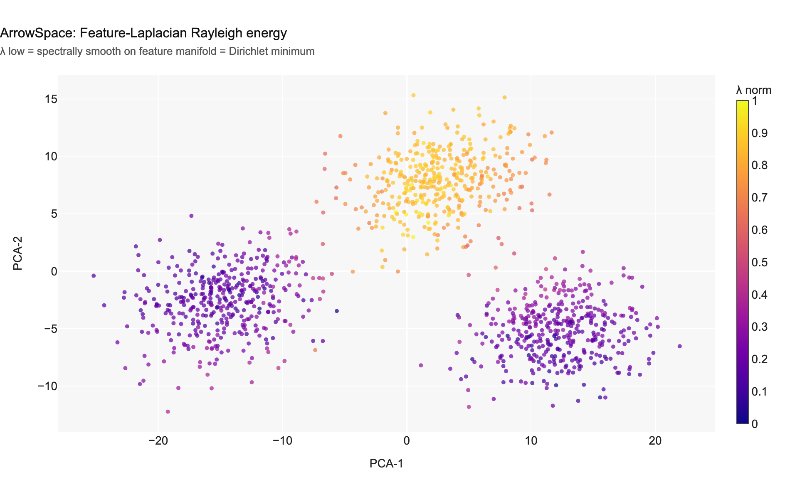
</div>

*Chart 1 — Feature-Laplacian Rayleigh energy. Low λ (dark purple) marks items that are spectrally smooth on the feature manifold. These are the arrowspace minima candidates.*

---

## Three Reference Methods

The notebook implements three independent vanilla baselines, each finding minima in item space. They are used as augmentation partners for arrowspace.

### KDE + density inversion

```python
kde = gaussian_kde(X_2d.T, bw_method='silverman')
kde_density_norm = (lambda d:(d-d.min())/(d.max()-d.min()+1e-9))(kde(X_2d.T))
kde_is_min  = kde_density_norm <= np.quantile(kde_density_norm, 0.10)
```

Fits a Gaussian KDE over the 2D PCA projection. Items in low-density regions are flagged as minima (the anti-modes). This is a classic mode-finding approach.

<div class="image-box">
    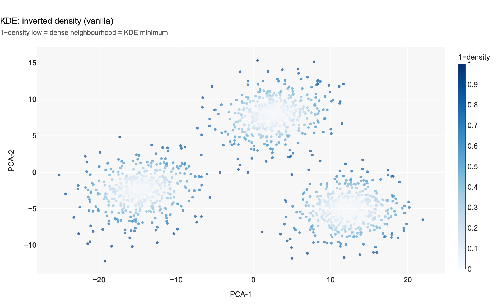
</div>

*Chart 2 — KDE inverted density. Low values mark high-density regions. Compare with Chart 1: the two signals have near-zero Pearson correlation (r = 0.02), confirming they capture independent structure.*

### Diffusion Maps

```python
K_rbf    = rbf_kernel(X_high, gamma=1.0/(2*sigma2))
P_diff   = np.diag(1.0/K_rbf.sum(axis=1)) @ K_rbf   # row-stochastic
eigvals, eigvecs = eigh(P_diff, subset_by_index=[N-6,N-1])
diff_coords  = eigvecs[:,1:3] * eigvals[np.newaxis,1:3]  # skip trivial
```

Constructs a Markov diffusion operator over item space. The non-trivial eigenvectors encode diffusion basins — connected components that are stable under long-time random walks. Items near the diffusion centroid live in the dominant attractor.

### Basin-Hopping

```python
def neg_log_kde(pt):
    kde_value = kde(np.array(pt).reshape(2, 1)).item()
    return -np.log(float(kde_value) + 1e-20)

seeds  = [X_2d.mean(0)+0.6*rng.standard_normal(2) for _ in range(14)]
bh_raw = [basinhopping(neg_log_kde, s,
              minimizer_kwargs={'method':'Nelder-Mead', ...},
              niter=60, T=1.2, stepsize=0.6, seed=42).x for s in seeds]
```

Alternates stochastic Monte Carlo perturbations with local Nelder-Mead optimisation to escape shallow traps. Multiple seeds are de-duplicated with agglomerative clustering. The notebook found **2 unique minima** from 14 seeds.

---

## The Augmentation Principle

**Cell 4 — blending arrowspace Rayleigh energy with vanilla scores**

This is the conceptual core of the notebook. Every vanilla method defines a scalar *distance-to-minimum* $$s(x)$$. ArrowSpace augments it with normalised Rayleigh energy $$R_\text{norm}(x)$$:

$$
s_{\text{aug}}(x) = \alpha \cdot s_{\text{vanilla}}(x) + (1 - \alpha) \cdot R_{\text{norm}}(x)
$$

```python
ALPHA = 0.50   # blend weight

kde_vanilla_score  = 1.0 - kde_density_norm    # high density → low score
diff_vanilla_score = diff_dist_n               # near centroid → low score
bh_vanilla_score   = bh_dist_n                 # near BH minimum → low score

# Augmented scores
kde_aug_score  = ALPHA * kde_vanilla_score  + (1-ALPHA) * R_norm
diff_aug_score = ALPHA * diff_vanilla_score + (1-ALPHA) * R_norm
bh_aug_score   = ALPHA * bh_vanilla_score   + (1-ALPHA) * R_norm
```

Similarly to what happens in search, as a clue for the claim that `arrowspace` is a generic algorithm (see [papers](/graph-wiring)), the blend works because the two signals are **nearly orthogonal**: vanilla methods find minima in *item space*, Rayleigh energy finds minima in *feature space*. Imposing both constraints simultaneously selects items that are *typical* **and** *manifold-consistent*.

The knob to tweak the mix (similar to *tau*-modulation in search):
- **α = 0** → pure arrowspace (spectral smoothness only)
- **α = 1** → pure vanilla (density / Markov basins only)
- **α = 0.5** → balanced blend

<div class="image-box">
    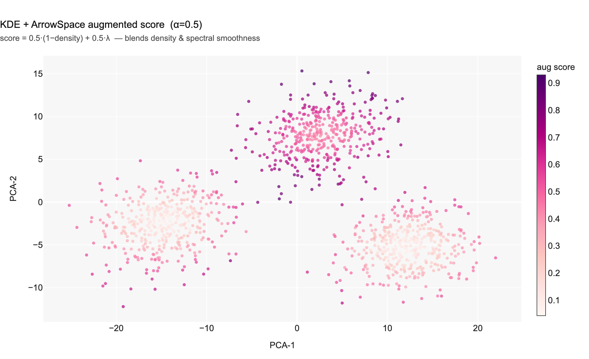
</div>

*Chart 3 — KDE + ArrowSpace blended score (α=0.5). The dark regions (joint minima) are tighter and more cluster-central than Chart 2 alone.*

<div class="image-box">
    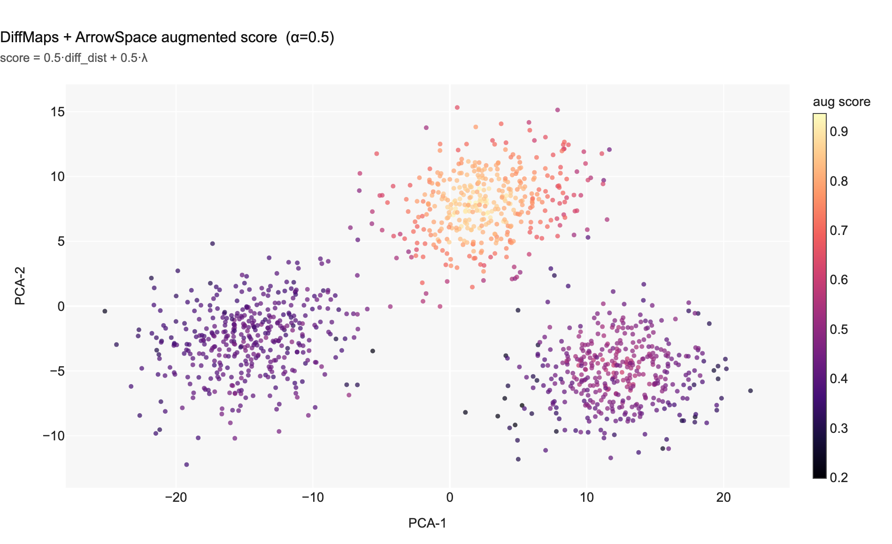
</div>

*Chart 5 — DiffMaps + ArrowSpace blended score. Diffusion distance and Rayleigh energy are largely complementary (Pearson r = 0.19), so their combination is additive in information.*

---

## Measuring Quality

To generilise a little, a sweep is run on the mix of α. This is similar to what is done in search via *tau*-modulation. The mix of the two signal is adjusted to catch the spot-on level of blending.

**Cell 5 — α sweep (21 steps from 0 to 1)**

```python
alphas = np.linspace(0.0, 1.0, 21)
rows   = []
for a in alphas:
    for name, van in [('KDE', kde_vanilla_score),
                      ('Diff', diff_vanilla_score),
                      ('BH',   bh_vanilla_score)]:
        score = a*van + (1-a)*R_norm
        mask  = score <= np.quantile(score, 0.10)
        rows.append({'alpha': round(float(a),2), 'method': name,
                     'purity': purity(mask, labels),
                     'mean_lam': float(R_norm[mask].mean())})
```

Two metrics are tracked at each α step:

- **Cluster purity (↑ better)**: fraction of the minima set belonging to the dominant ground-truth cluster.
- **Mean λ (↓ better)**: average Rayleigh energy inside the minima set — lower means more spectrally smooth.

**Cell 6 — comparison table**

| Method | Cluster purity | Jaccard w/ ArrowSpace | Mean λ (norm) |
| :-- | :-- | :-- | :-- |
| ArrowSpace | 0.558 | 1.000 | 0.1081 |
| KDE (vanilla) | 0.383 | 0.026 | 0.4573 |
| KDE + ArrowSpace | 0.500 | 0.148 | 0.1645 |
| DiffMaps (vanilla) | 0.383 | 0.043 | 0.4501 |
| DiffMaps + ArrowSpace | 0.600 | 0.311 | 0.1674 |
| BasinHop (vanilla) | 0.525 | 0.017 | 0.5495 |
| **BasinHop + ArrowSpace** | **1.000** | 0.212 | **0.1555** |

The most striking result: **BasinHop + ArrowSpace reaches 100% cluster purity** at α = 0.35 — every discovered minimum is a true on-manifold energy valley. All vanilla methods have mean λ in the range 0.45–0.55; all augmented variants drop to 0.16–0.17, confirming the augmentation forces minima to respect spectral geometry, not just item-space topology.

---

## Visualising the Quality Gap

<div class="image-box">
    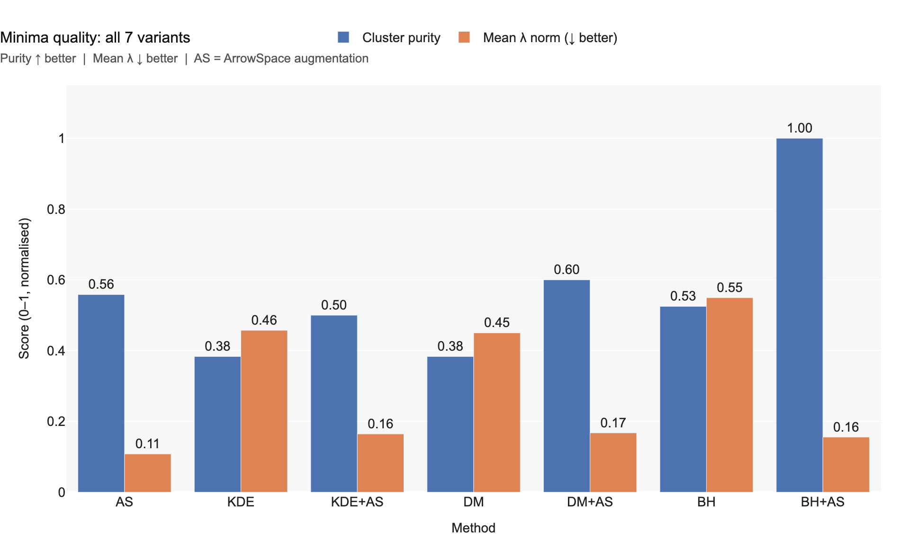
</div>

*Chart 7 — Cluster purity (blue) and mean λ (orange) for all 7 method variants. Every augmented variant beats its vanilla counterpart on both metrics.*

The α sweep shows the trade-off trajectory explicitly.

<div class="image-box">
    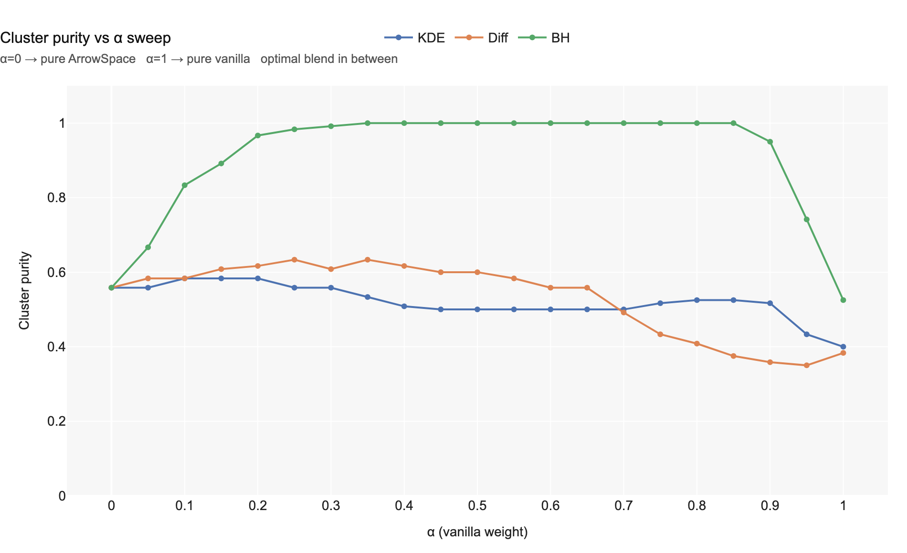
</div>

*Chart 8 — Cluster purity across the α sweep. Purity peaks at intermediate α for all three methods. At α = 1 (pure vanilla) purity collapses to baseline levels. The BH curve achieves 1.0 purity near α = 0.35.*

<div class="image-box">
    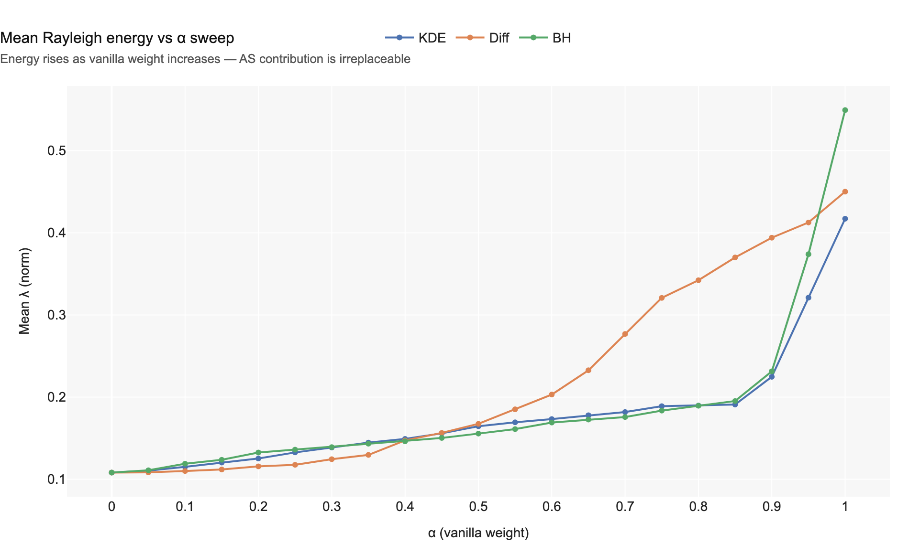
</div>

*Chart 9 — Mean Rayleigh energy vs α. Energy rises monotonically as α → 1, confirming that the spectral contribution from arrowspace cannot be recovered by any vanilla method alone.*

---

## Why the Two Signals Are Independent

**Cell 8, Charts 11–12 — cross-correlation checks**

The augmentation argument rests on independence. If the two scalars were correlated, blending would add no new information.

<div class="image-box">
    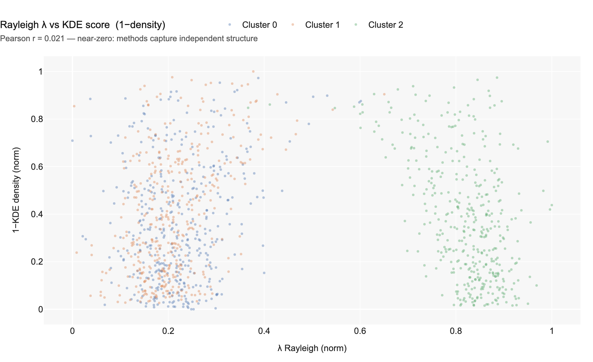
</div>

*Chart 11 — Rayleigh energy vs KDE score (1−density). Pearson r = 0.02. The two scalars are essentially orthogonal: spectral smoothness on the feature graph is independent of item-space density.*

<div class="image-box">
    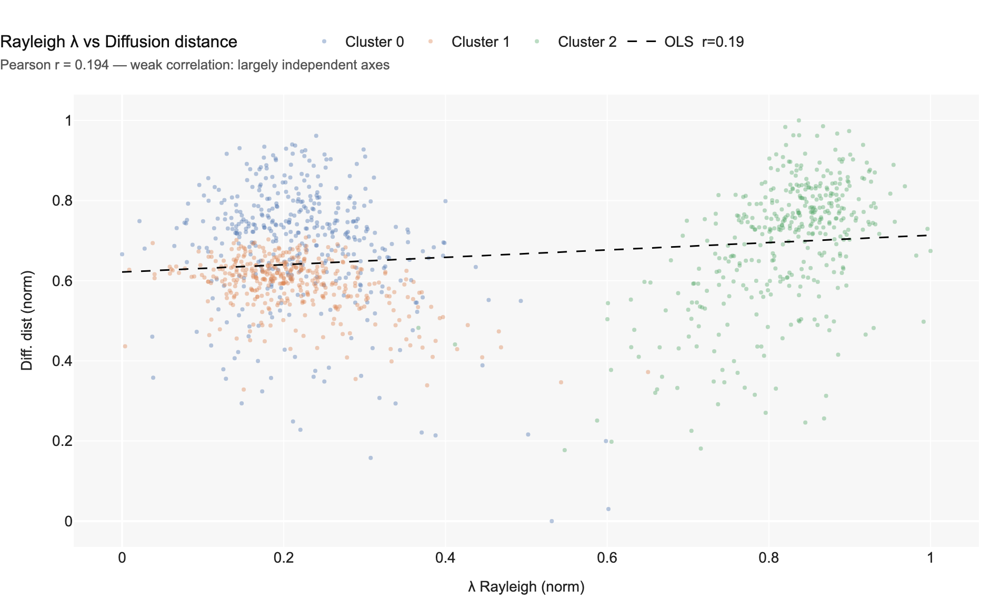
</div>

*Chart 12 — Rayleigh energy vs diffusion distance. Pearson r = 0.19 — weak positive correlation. The two signals share some structure (both respond to cluster membership) but remain substantially complementary.*

The Jaccard heatmap summarises all pairwise overlaps across the 7 method variants.

<div class="image-box">
    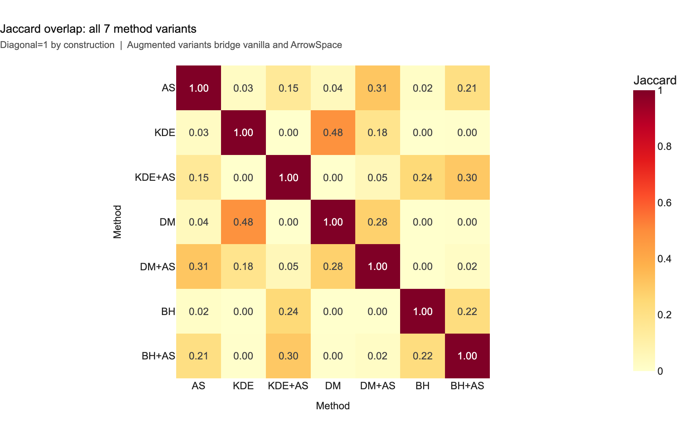
</div>

*Chart 10 — 7×7 Jaccard overlap matrix. The near-zero off-diagonal values between ArrowSpace and the three vanilla methods (0.017–0.043) confirm that they select qualitatively different items. Augmented variants form a bridge (0.148–0.311) — they preserve spectral structure while incorporating item-space geometry.*

---

## Basin-Hopping Overlay

The qualitative shift from vanilla to augmented is clearest in the Basin-Hopping overlay.

Chart 6 overlays four point classes in PCA-2D: grey background items,
**orange** (vanilla Basin-Hopping only — removed by augmentation), **purple**
(augmented only — added by augmentation), and **green** (stable, present in both
sets). The three Gaussian clusters sit at bottom-left, right, and top-right in
this projection. The right and top-right clusters produce green and purple minima
because those points satisfy both constraints simultaneously: Basin-Hopping's
`neg_log_kde` confirms a sharp, deep density mode there, and their normalised
Rayleigh quotient is low — their 32-dimensional feature pattern is smooth on the
feature-space Laplacian, meaning they are genuine attractors of the feature
manifold, not just geometric accidents. The bottom-left cluster tells the
opposite story. Orange points appear there: vanilla BH found a density mode, but
ArrowSpace rejected those items because their $$\lambda$$ was too high —
they are rough and atypical on the feature graph rather than spectrally smooth.
This is consistent with vanilla BH reaching a purity of only 0.525, barely above
the three-class random baseline of 0.33: the bottom-left KDE basin is shallower
and more diffuse than the other two, wide enough for BH seeds to converge there
from multiple directions but not deep enough to be a semantically coherent valley.
Because the Rayleigh energy and KDE density are nearly orthogonal (Pearson
$$r \approx 0.02$$), satisfying both simultaneously is a strictly tighter
criterion. A point that passes both tests is **a density peak and a
feature-manifold attractor** — the strongest available definition of a real local
minimum in latent space. The augmented set, with mean $$\lambda = 0.155$$
against 0.550 for vanilla BH and cluster purity jumping to 1.000, confirms the
principle directly: ArrowSpace does not relocate the minima, it filters out the
geometric false positives that no item-space method alone can detect. At this point
it is possible to say with confidence that this is a clue for *the bottom-left cluster to be a
false positive*.

<div class="image-box">
    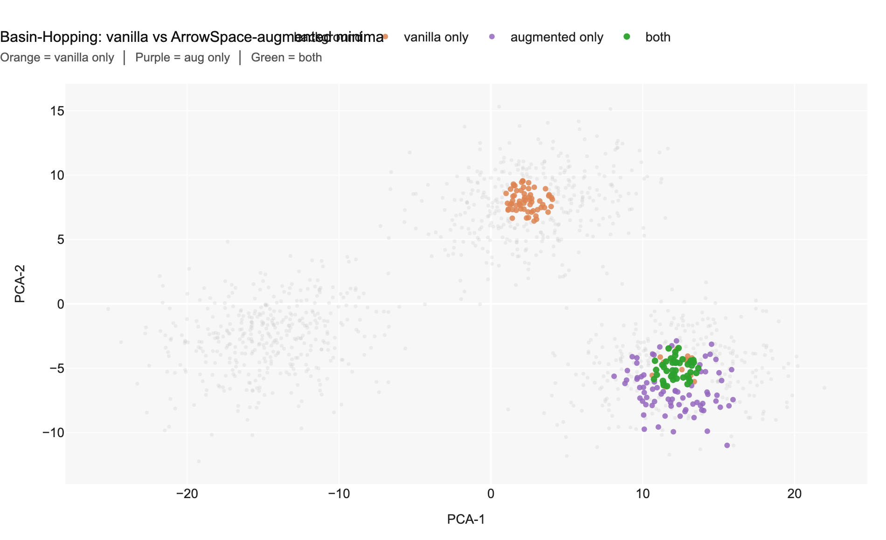
</div>

*Chart 6 — Basin-Hopping overlay: orange = vanilla-only minima (lost after augmentation); purple = augmented-only minima (gained); green = stable minima in both sets. Augmentation removes scattered orange points from cluster borders and replaces them with purple points deep inside cluster cores.*

---

## Take-Aways

Three results stand out from the notebook:

* **Orthogonality justifies blending.** Pearson r between Rayleigh energy and KDE score is +0.02; between Rayleigh energy and diffusion distance only +0.19. The two information sources are nearly independent, so combining them adds genuine new signal rather than redundancy.
* **BasinHop + ArrowSpace is the strongest combination.** At α = 0.35, the augmented basin-hopping minima reach 100% cluster purity — every discovered minimum is a true on-manifold energy valley.
* **The α knob is a tunable axis.** (like in *tau*-modulation for search) Dial α toward 0 to emphasise spectral smoothness (useful for OOD and anomaly detection); dial α toward 1 to emphasise the geometric/density structure of the baseline.

---

## Connection to Mechanistic Interpretability

Anthropic's [*Mapping the Mind of a Large Language Model*](https://www.anthropic.com/research/mapping-mind-language-model) work identifies millions of SAE features inside Claude 3 Sonnet and measures the *distance* between features to map conceptual neighbourhoods. The core challenge is identical: navigating a high-dimensional, high-semantic latent space to find stable, meaningful regions.

ArrowSpace's feature Laplacian offers a complementary lens. Where dictionary learning asks *which neuron patterns recur across contexts*, the Rayleigh quotient asks *which regions of feature space are spectrally smooth* — i.e., geometrically stable under the feature graph topology. Finding local minima by this criterion is a necessary precursor to:

1. **Feature clustering** — grouping SAE features by spectral proximity rather than cosine angle.
2. **Cross-layer tracking** — following minima across transformer layers to trace circuit depth.
3. **Causal intervention** — identifying spectrally stable directions in activation space as candidate steering targets.

This notebook is the starting point for that track. It validates that arrowspace's Rayleigh energy provides independent, complementary structure to item-space methods — the prerequisite for any downstream mechanistic application.

---

*Notebook:* [`01__arrowspace_local_minima.ipynb`](https://github.com/tuned-org-uk/arrowspace-analysis/blob/main/notebooks/01__arrowspace_local_minima.ipynb)  
*Diagrams:* [`output__01/`](https://github.com/tuned-org-uk/arrowspace-analysis/tree/main/notebooks/output__01)  
*ArrowSpace paper:* [JOSS — Spectral Indexing of Embeddings](https://joss.theoj.org/papers/10.21105/joss.09002.pdf)  
*Anthropic reference:* [Mapping the Mind of a Large Language Model](https://www.anthropic.com/research/mapping-mind-language-model)
